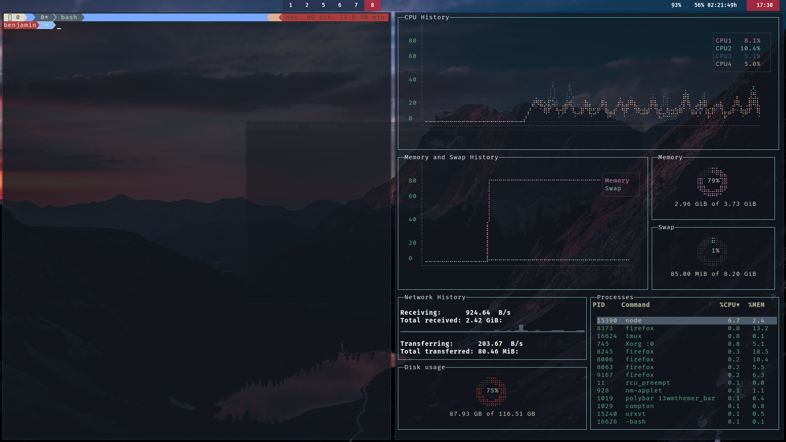
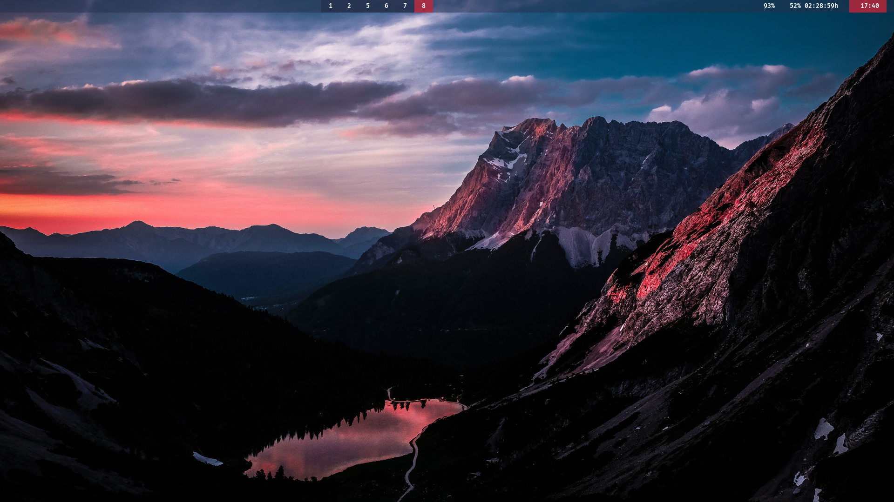

# ArcoLinux BYOI bgallois

Bgallois arcolinux distribution:
* wm: i3-gaps
* terminal: urxvt
* multiplexer: tmux
* editor: vim
* theme: minimal custom, compatible 1+ screens

# Build the iso

* On an arcoslinux machine open urxvt
* git clone https://github.com/bgallois/arco-i3/
* cd arcos-i3/installation-scripts
* ./30-build-the-iso-the-first-time.sh

# Install the iso

## Hardware requirement
* At least 2 cores cpu.

## Installation
* Boot with a live usb.
* Follow the installer.
* After restart press ```Mod4+Enter``` to finish the installation.




